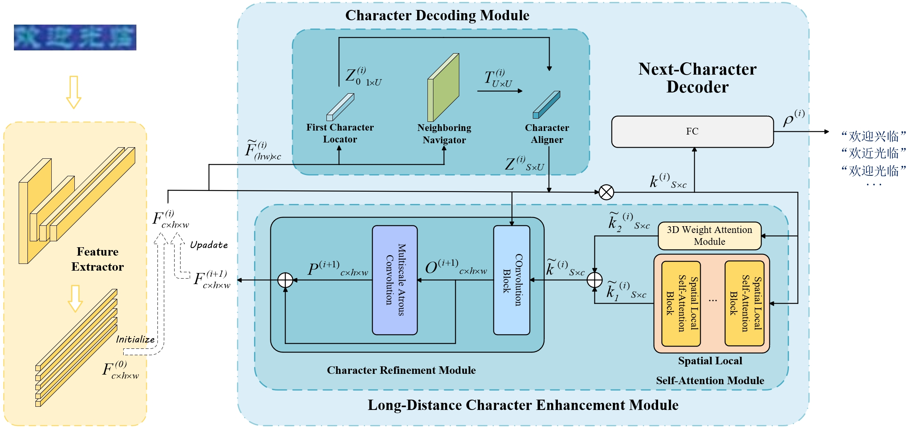

## MIRROR: Multi-scale iterative refinement for robust chinese text recognition



## Environment
This work was conducted with PyTorch 1.13.1, CUDA 11.7, python 3.7.
```python
pip install -r requirements.txt
```

## Download
* The Chinese Text Recognition Benchmark datasets are available at the following link: https://github.com/FudanVI/benchmarking-chinese-text-recognition.
* The Traditional Chinese Text Recognition dataset is available at the following link: https://github.com/GitYCC/traditional-chinese-text-recogn-dataset.
* The Chinese Scene Text Recognition Technology Innovation Competition dataset is available at the following link: https://aistudio.baidu.com/datasetdetail/10140.

## Training
* Execute the following command to train the MIRROR model.
```bash
CUDA_VISIBLE_DEVICES=0 python train.py -c=config/mirror.yml [--model_name=mirror] [--enc_version=base] [--iters=2] [--num_sa_layers=1] [--num_mg_layers=1] [--max_len=32]
```
## Testing

- Execute the following command to test the MIRROR model.

```bash
CUDA_VISIBLE_DEVICES=0 python test.py -c=config/mirror.yml --model_name=mirror [--enc_version=base] [--iters=2] [--num_sa_layers=1] [--num_mg_layers=1]
```

